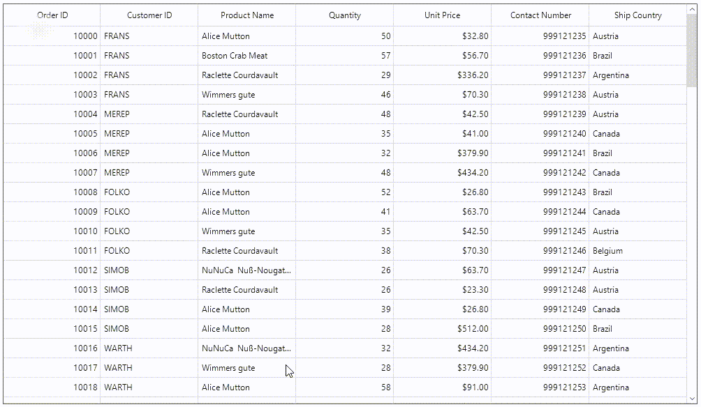

# How to Scroll Multiple Items for One Mouse Wheel in WinForms DataGrid?

This example illustrates how to scroll multiple items for one mouse wheel in [WinForms DataGrid](https://www.syncfusion.com/winforms-ui-controls/datagrid) (SfDataGrid).

By default, in `DataGrid` you can scroll only one item while doing MouseWheel. But you can scroll multiple items while doing MouseWheel by handling the MouseWheel event in [SfDataGrid.TableControl](https://help.syncfusion.com/cr/windowsforms/Syncfusion.WinForms.DataGrid.TableControl.html). You can achieve scroll multiple items while doing MouseWheel by increase and decrease the current position of the scroll box on the scrollbar control based on the delta value.

```C#

sfDataGrid1.TableControl.MouseWheel += OnTableControl_MouseWheel;

private void OnTableControl_MouseWheel(object sender, MouseEventArgs e)
{
   if (e.Delta == 0)
      return;
      
   var smallChange = sfDataGrid1.TableControl.ScrollRows.ScrollBar.SmallChange;
   
   if (e.Delta > 0)
      sfDataGrid1.TableControl.ScrollRows.ScrollBar.Value -= (4 * smallChange);
   else
      sfDataGrid1.TableControl.ScrollRows.ScrollBar.Value += (4 * smallChange);

   this.sfDataGrid1.TableControl.UpdateScrollBars();
   this.sfDataGrid1.TableControl.Invalidate();
}

```

